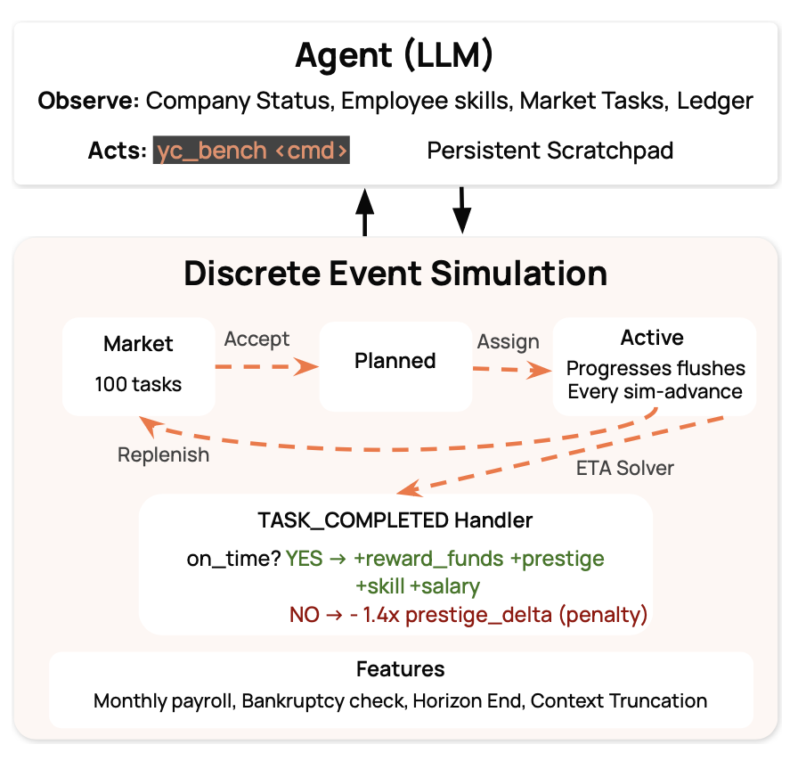
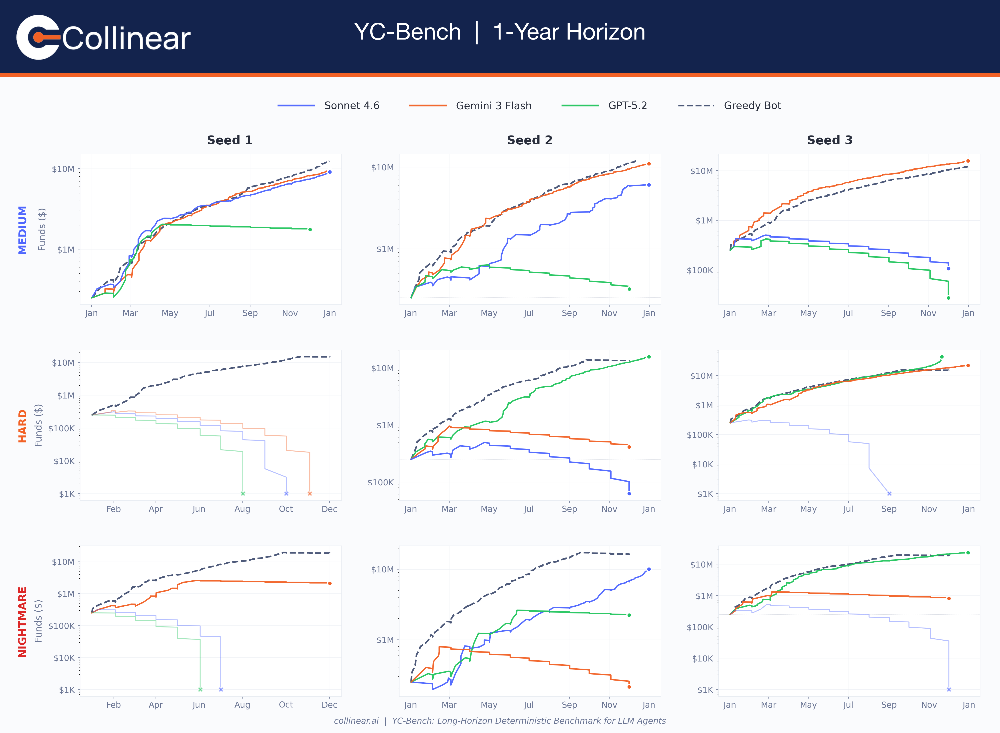
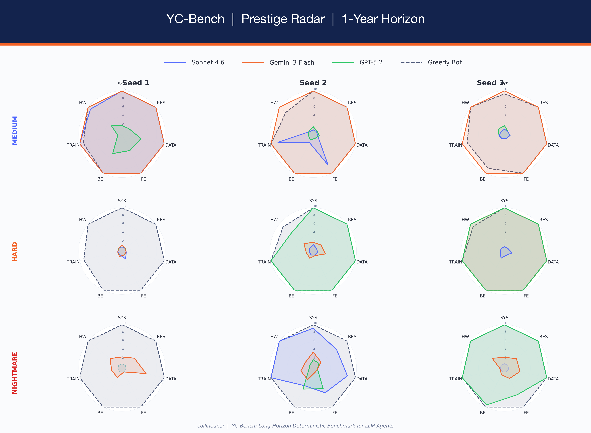

#  YC-Bench

A long-horizon deterministic benchmark for LLM agents. The agent plays CEO of an AI startup over a simulated 1–3 year run, operating exclusively through a CLI tool against a SQLite-backed discrete-event simulation.

The benchmark tests whether agents can manage compounding decisions: prestige specialisation, employee allocation, cash flow, and deadline risk — sustained over hundreds of turns.

---

## Setup

### Prerequisites

- Python 3.12+
- [`uv`](https://github.com/astral-sh/uv)

### Install

```bash
git clone <repo-url>
cd YC_Bench
uv sync
```

### API key

```bash
# .env  (any LiteLLM-compatible provider)
ANTHROPIC_API_KEY="sk-ant-..."     # for anthropic/claude-*
GEMINI_API_KEY="AIza..."           # for gemini/gemini-*
OPENROUTER_API_KEY="sk-or-v1-..."  # for openrouter/*
OPENAI_API_KEY="sk-..."            # for openai/*
```

### Run

```bash
uv run yc-bench run \
  --model gemini/gemini-3-flash-preview \
  --seed 1 \
  --config medium
```

Outputs a SQLite DB in `db/` and a JSON rollout in `results/`.

### Run multiple models in parallel

```bash
bash scripts/run_benchmark.sh --seed 1 --config hard
```

---

## How it works



### Core loop

1. Agent calls `yc-bench sim resume` to advance time to the next event.
2. The engine flushes task progress, fires due events, applies payroll.
3. Agent reads wake events and decides: accept tasks, assign employees, dispatch, cancel.
4. Repeat until bankruptcy or horizon end.

The simulation ends on **bankruptcy** (funds < 0 after payroll), **horizon end** (1–3 years), or **max turns** (if configured). If the agent doesn't call `sim resume` for 10 consecutive turns, the loop forces one automatically.

### Key mechanics

- **Funds**: start at $250K. Monthly payroll is deducted automatically. Task rewards scale with prestige (`base × (1 + 0.55 × (prestige − 1))`).
- **4 domains**: `research · inference · data/environment · training`. Each domain tracks prestige independently in [1.0, 10.0].
- **Prestige gating**: tasks require a minimum prestige level. Most tasks need prestige 3–5, so the agent must climb from 1.0 by completing easier tasks first. First 10 market tasks are stratified `[1,1,1,1,2,2,2,3,3,4]` to bootstrap progression.
- **Employees**: 10 employees across 3 tiers (junior/mid/senior). The agent sees only each employee's tier and salary — not their per-domain skill rates. A junior can secretly be a superstar in one domain, so the agent must infer productivity from task progress observations.
- **Throughput splitting**: an employee assigned to N active tasks has `effective_rate = base_rate / N`. Focus beats breadth.
- **Task success**: on-time completion awards funds + prestige + skill boosts + 1% salary bump (compounding payroll pressure). Late completion penalises prestige (1.4×). Cancellation penalises harder (2.0×).
- **Progress checkpoints**: the agent is woken at 25%, 50%, 75%, and 100% completion — providing data points to estimate employee productivity.
- **Scratchpad**: persistent notes in the DB that survive context truncation (only last 20 conversation rounds are kept).

### Agent CLI

All commands return JSON. The agent interacts via `run_command("yc-bench <cmd>")`.

```bash
# Observe
yc-bench company status                          # funds, prestige, runway
yc-bench employee list                           # tier, salary, active tasks
yc-bench market browse [--domain X] [--limit N]  # available tasks
yc-bench task list [--status X]                  # your tasks
yc-bench task inspect --task-id UUID             # progress, deadline, assignments
yc-bench finance ledger                          # transaction history
yc-bench report monthly                          # P&L per month

# Act
yc-bench task accept --task-id UUID              # pull from market
yc-bench task assign --task-id UUID --employee-id UUID
yc-bench task dispatch --task-id UUID            # start work
yc-bench task cancel --task-id UUID --reason ""  # cancel (2× prestige penalty)
yc-bench sim resume                              # advance time
yc-bench scratchpad write/append/clear           # persistent memory
```

---

## Configuration

Experiment presets live in `src/yc_bench/config/presets/` as TOML files. Pass the preset name via `--config`.

| Config | Employees | Tasks | Tests |
|--------|-----------|-------|-------|
| **tutorial** | 3 | 50 | Basic accept→assign→dispatch loop |
| **easy** | 5 | 100 | Throughput awareness |
| **medium** | 5 | 150 | Prestige climbing + domain specialization |
| **hard** | 7 | 200 | Precise ETA reasoning |
| **nightmare** | 8 | 300 | Sustained perfection under compounding payroll |

See `default.toml` for the full list of tunable parameters.

---

## Benchmark results

### Sonnet 4.6 vs Gemini 3 Flash vs GPT-5.2 — 1-year horizon, 3 seeds per config



#### Survival rates

| Config | Sonnet 4.6 | Gemini 3 Flash | GPT-5.2 |
|--------|-----------|----------------|---------|
| **medium** | 3/3 | 3/3 | 3/3 |
| **hard** | 1/3 | 2/3 | 2/3 |
| **nightmare** | 1/3 | 3/3 | 2/3 |

#### Final funds (bankrupt = funds < 0)

| Config | Seed | Sonnet 4.6 | Gemini 3 Flash | GPT-5.2 |
|--------|------|-----------|----------------|---------|
| medium | 1 | **$9.1M** | **$9.5M** | **$1.8M** |
| medium | 2 | **$6.1M** | **$11.0M** | **$321K** |
| medium | 3 | **$107K** | **$15.8M** | **$28K** |
| hard | 1 | bankrupt | bankrupt | bankrupt |
| hard | 2 | **$63K** | **$412K** | **$15.7M** |
| hard | 3 | bankrupt | **$21.9M** | **$43.5M** |
| nightmare | 1 | bankrupt | **$2.1M** | bankrupt |
| nightmare | 2 | **$10.1M** | **$214K** | **$2.2M** |
| nightmare | 3 | bankrupt | **$805K** | **$23.6M** |

**Overall: Gemini 8/9 · GPT-5.2 7/9 · Sonnet 5/9**

#### Key findings

- **Gemini leads on consistency** (8/9 survival). The only model to sweep all 3 nightmare seeds.
- **GPT-5.2 has the highest ceiling.** Hard seed 3: $43.5M vs Gemini's $21.9M. When it survives, it tends to outperform by a wide margin.
- **Sonnet is high-variance.** Nightmare seed 2: $10.1M (best nightmare result), but 4/9 bankruptcies overall.
- **Win rate predicts survival.** Every run with >58% task win rate survived. Every run below 40% went bankrupt.

#### Prestige specialization



---

Please cite our work if you find it useful!

```bibtex
@misc{collinear-ai2025ycbench,
  author       = {{Collinear AI}},
  title        = {{YC-Bench}: Your Company Bench — A Long-Horizon Coherence Benchmark for {LLM} Agents},
  year         = {2025},
  howpublished = {\url{https://github.com/collinear-ai/yc-bench}},
  note         = {Accessed: 2026-02-25}
}
```
