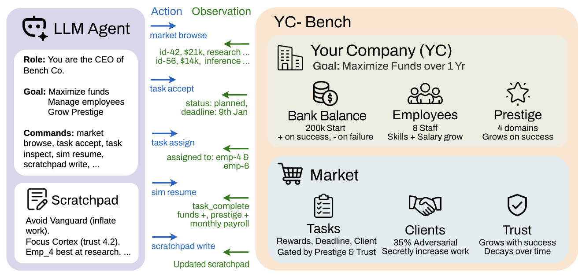
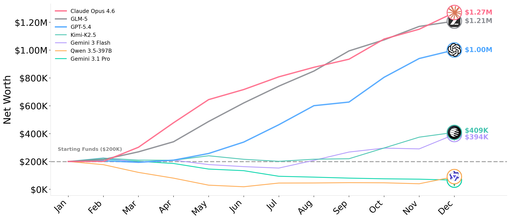

#  YC-Bench

[](https://collinear-ai.github.io/yc-bench/)
[](https://www.python.org/)
[](https://opensource.org/licenses/MIT)

A long-horizon deterministic benchmark for LLM agents. The agent operates a simulated AI startup over a one-year horizon, starting with $200,000 in funds, interacting exclusively through a CLI against a SQLite-backed discrete-event simulation.

The benchmark tests whether agents can manage compounding decisions: task selection, employee allocation, client trust, cash flow, and adversarial client detection — sustained over hundreds of turns.

<p align="center">
  
</p>

## How it works

### Core loop

1. Agent calls `sim resume` to advance the clock to the next event (task checkpoint, payroll, or horizon end).
2. The engine processes task progress, fires due events, and deducts monthly payroll.
3. Agent receives a status summary with events since the last turn, then issues observe and act commands.
4. Repeat until bankruptcy (funds < 0) or the one-year horizon ends.

Between time advances, the agent may issue arbitrarily many actions within a single turn. Work progresses only during business hours (weekdays), and payroll is deducted on the first business day of each month.

### Key mechanics

- **Tasks and domains**: The agent earns revenue by completing tasks from a marketplace. Each task belongs to one of four domains — `training · inference · research · data engineering` — and is issued by a client. Tasks have a reward, a deadline (activated on acceptance), and a work quantity employees must complete. Higher prestige unlocks higher-reward tasks and scales their payout. Failing a deadline incurs a 35% penalty of the reward and a prestige reduction.
- **Employees**: A fixed roster across 3 tiers (junior/mid/senior) with per-domain productivity levels queryable via `employee list`. Productivity distributions are spiky — a senior may have high throughput in training but low in research. Successful completions grant a productivity boost in that domain but also a salary bump, so payroll grows monotonically.
- **Clients and trust**: Completing tasks for a client builds trust, which reduces future work requirements and unlocks higher-tier tasks. However, completing for one client slightly decays trust with all others.
- **Adversarial clients**: A subset of clients are adversarial — after acceptance, they inflate work quantities, making deadlines nearly impossible. Adversarial status is hidden. These clients offer competitively high rewards, so the agent must infer adversarial behavior from repeated failures.
- **Memory**: Conversation history is truncated to the most recent 20 turns. The agent can write to a persistent scratchpad injected into the system prompt every turn — its sole mechanism for retaining information across context truncation.

### Agent CLI

All commands return JSON. The agent interacts via `run_command("yc-bench <cmd>")`.

| Category | Command | Effect |
|----------|---------|--------|
| Observe | `company status` | Funds, prestige, payroll |
| Observe | `employee list` | Names, tiers, salaries, productivity |
| Observe | `market browse` | Available tasks with client, reward, domains |
| Observe | `task list` | Accepted tasks with status and progress |
| Observe | `task inspect --task-id T` | Per-domain progress, deadline, assignments |
| Observe | `client list` | Client trust levels and tiers |
| Observe | `client history` | Per-client success/failure counts |
| Observe | `finance ledger` | Full transaction history |
| Task | `task accept --task-id T` | Accept from market; starts deadline |
| Task | `task assign --task-id T --employees E` | Assign employees to task |
| Task | `task dispatch --task-id T` | Begin work on assigned task |
| Task | `task cancel --task-id T --reason R` | Abandon task; prestige penalty |
| Sim | `sim resume` | Advance clock to next event |
| Memory | `scratchpad write --content C` | Overwrite persistent notes |
| Memory | `scratchpad append --content C` | Append to persistent notes |

---

## Setup

### Prerequisites

- Python 3.12+
- [`uv`](https://github.com/astral-sh/uv)

### Install

```bash
git clone https://github.com/collinear-ai/yc-bench.git
cd yc-bench
uv sync
```

### API key

```bash
# .env  (any LiteLLM-compatible provider)
ANTHROPIC_API_KEY="sk-ant-..."     # for anthropic/claude-*
GEMINI_API_KEY="AIza..."           # for gemini/gemini-*
OPENROUTER_API_KEY="sk-or-v1-..."  # for openrouter/*
OPENAI_API_KEY="sk-..."            # for openai/*
```

### Run

```bash
uv run yc-bench run \
  --model gemini/gemini-3-flash-preview \
  --seed 1 \
  --config default
```

Outputs a SQLite DB in `db/` and a JSON rollout in `results/`.

### Run multiple models in parallel

```bash
bash scripts/run_benchmark.sh --seeds "1 2 3" --config default
```

---

## Configuration

Experiment presets live in `src/yc_bench/config/presets/` as TOML files. Pass the preset name via `--config`.

See `default.toml` for the full list of tunable parameters.

---

## Benchmark results

<p align="center">
  
</p>

---

Please cite our work if you find it useful!

```bibtex
@misc{collinear-ai2025ycbench,
  author       = {{Collinear AI}},
  title        = {{YC-Bench}: Your Company Bench — A Long-Horizon Coherence Benchmark for {LLM} Agents},
  year         = {2025},
  howpublished = {\url{https://github.com/collinear-ai/yc-bench}},
  note         = {Accessed: 2026-02-25}
}
```
